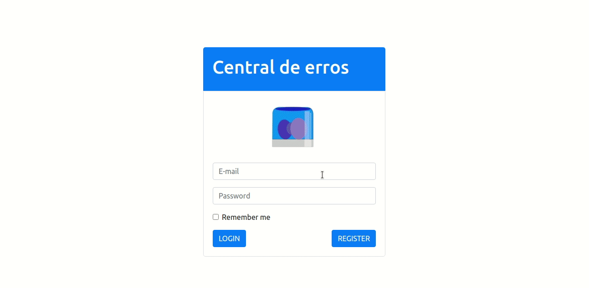

<h1 align="center">
  
  <br />
  Central de erros
</h1>


## Projeto

Este é um projeto desenvolvido durante a aceleração em Java da Codenation. O projeto busca implementar uma API Rest para centralizar o registro de erros de aplicações. Este repositório contém a parte do front-end da aplicação.

O repositório do back-end da aplicação pode ser acesso neste [link](https://github.com/mateusleiteaalmeida/codenation-java-central-de-erros-back-end).


## Tecnologia

Esse projeto foi desenvolvido utilizando a seguinte tecnologia:

- [React](https://reactjs.org/)


## Iniciando
Clone o projeto e acesse a pasta

```bash
$ git clone https://github.com/mateusleiteaalmeida/codenation-react-central-de-erros-front-end.git && cd codenation-react-central-de-erros-front-end
```

Siga os passos abaixo
```bash
# Instalar as dependências
$ npm install

# Iniciar o projeto
$ npm start
```


Para acessar a central de erros é possível utilizar um usuário padrão: 
- Email: <span>_macgyver@</span>email.com_
- Senha: _senha123_


## Layout

O layout da central de erros pode ser visualizado abaixo:




## Colaboradores
[Ana Caroline Andrade](https://github.com/CarolSi-hub)</li></br>
[Filipi Firmino](https://github.com/ic3web)</li></br>
[Mateus Leite](https://github.com/mateusleiteaalmeida)</li>
</ul>


## Empresas colaboradoras
Projeto desenvolvido por [Codenation](https://www.codenation.dev/) e [Trybe](https://www.betrybe.com/) com a colaboração da [Conta Azul](https://contaazul.com/).
